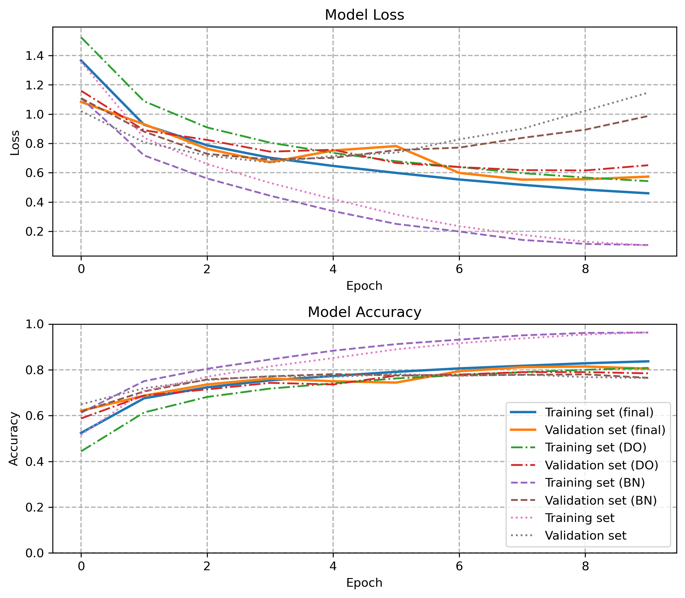
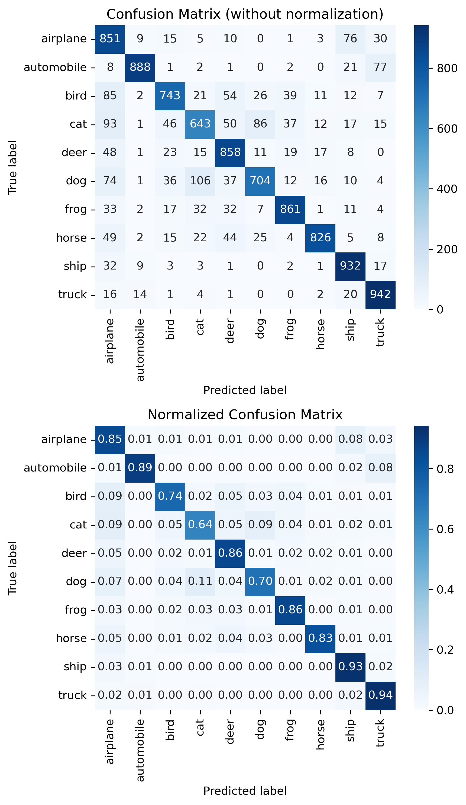

# Multi-Class-Classification-using-CNNs-for-CIFAR10-Dataset
This repository contains Python code implementing a convolutional neural network (CNN) to perform multi-class image classification on the CIFAR-10 dataset using the Keras API.

## Overview
The project aims to:
- Train artificial neural networks for CIFAR-10 classification.
- Experiment with regularization techniques such as dropout and batch normalization.
- Analyze model performance through loss/accuracy plots and confusion matrices.
- Conduct a parameter study on the model's architecture including kernel size, number of neurons, and batch size.
- The CNN models are built with multiple convolutional and max-pooling layers, followed by fully connected dense layers. 

## Results Summary
- Smaller kernel sizes (3x3) improve test accuracy.
- Moderate batch sizes (64) balance training speed and generalization.
- Adding both batch normalization and dropout yields the best validation performance and reduces overfitting.
- Confusion matrix reveals that the model generally classifies well except for some confusions among cats, dogs, and birds.

